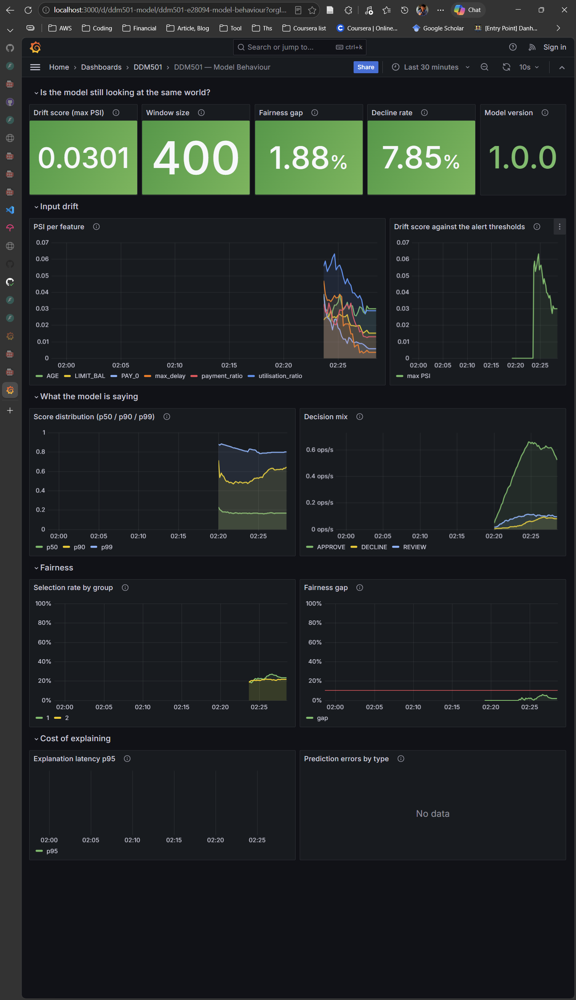
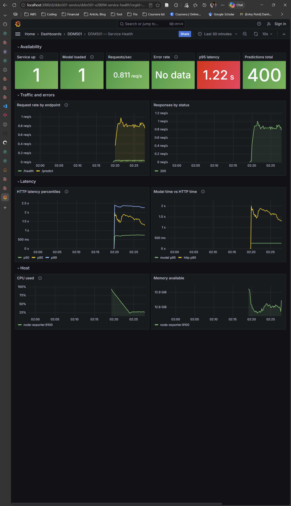
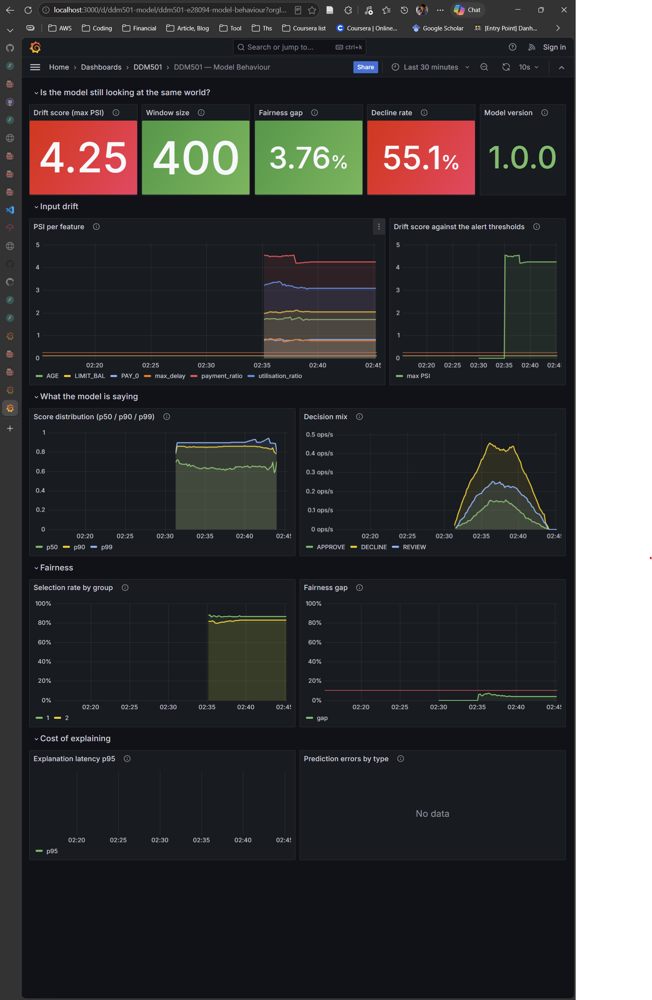
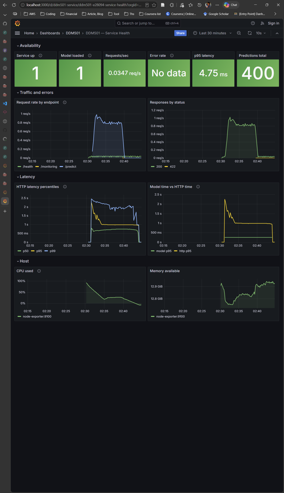
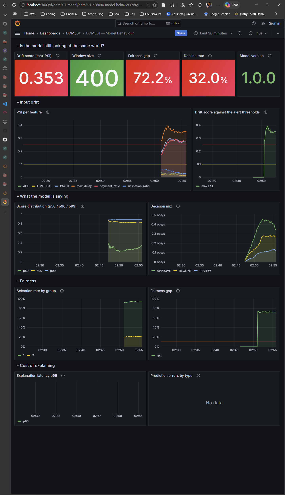
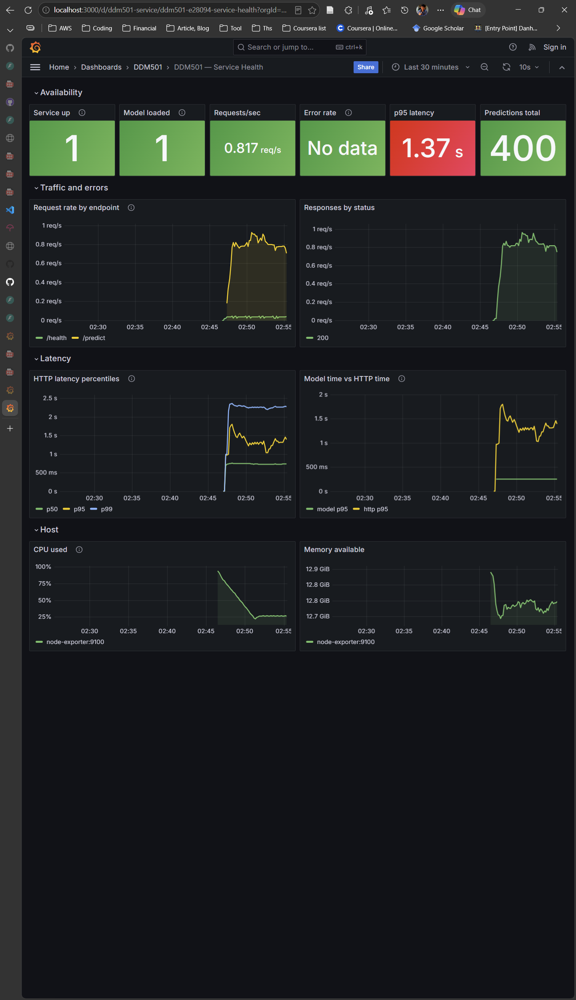
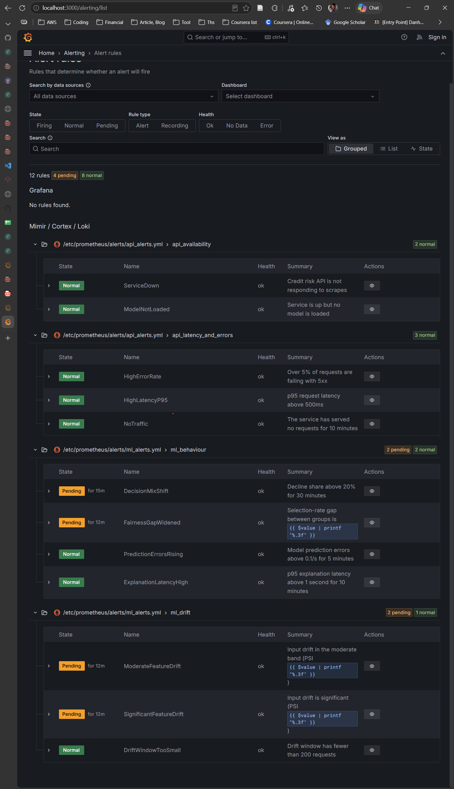

# Lab 4 — Monitoring and Production Deployment

[](https://github.com/NamTe/msa36hn-ddm501-lab4/actions/workflows/ci.yml)
[](https://codecov.io/gh/NamTe/msa36hn-ddm501-lab4)

**DDM501 — AI in DevOps, DataOps, MLOps · Session 9 · 15% of the grade**

Lab 3 ended with a test suite that catches broken models before they ship.
This lab starts from the failure that suite cannot catch: a model that is
still correct, still passing every test, and quietly becoming wrong because
the world moved.

---

## The problem

You cannot monitor accuracy in production.

Whether an applicant defaults is known next month at the earliest. For an
applicant you declined, it is never known at all — you refused them credit, so
there is no outcome to observe. By the time an accuracy number arrives, the
model has been deciding on the wrong distribution for weeks.

So production ML monitoring means watching **proxies that move before the
accuracy does**:

| Signal | What it answers | Metric |
|---|---|---|
| Input drift | Do the applicants still look like the training population? | `ml_feature_drift_psi` |
| Output drift | Has the distribution of scores shifted? | `ml_prediction_score` |
| Decision mix | Is more work being pushed to manual review? | `ml_decisions_total` |
| Fairness gap | Is one group being flagged at a different rate? | `ml_fairness_gap` |

None of these proves the model is wrong. Each is a reason to look.

---

## What you are given, and what you write

**Given** — read these before you write anything:

- `app/metrics.py` — every metric, declared, with the reason for its type.
  This is a catalogue you should be able to defend line by line.
- `app/schemas.py` — the response shapes.
- `monitoring/prometheus/alerts/api_alerts.yml` — five worked alert rules.
- `monitoring/grafana/dashboards/service-health.json` — a worked dashboard.
- `monitoring/prometheus/tests/alert_tests.yml` — promtool unit tests for the
  rules you are about to write.
- `tests/` — 79 tests. **They are the specification.** Read the test before
  you write the function; each one names the failure it exists to prevent.

**You write** — thirteen tasks, marked `TODO` in the files:

| # | File | What |
|---|---|---|
| 1 | `app/monitoring.py` | `population_stability_index` |
| 2 | `app/monitoring.py` | `MonitoringWindow.compute_drift` |
| 3 | `app/monitoring.py` | `MonitoringWindow.compute_fairness` |
| 4 | `app/monitoring.py` | `MonitoringWindow.publish` |
| 5 | `app/main.py` | `_observe` — one trap in here, read the docstring |
| 6 | `app/main.py` | `GET /metrics` |
| 7 | `app/main.py` | `GET /monitoring` |
| 8 | `app/main.py` | `POST /explain` |
| 9 | `app/middleware.py` | `MetricsMiddleware.dispatch` |
| 10 | `app/explain.py` | `Explainer.explain` |
| 11 | `scripts/make_reference.py` | `build_reference` |
| 12 | `monitoring/prometheus/alerts/ml_alerts.yml` | seven alert rules |
| 13 | `monitoring/grafana/dashboards/model-behaviour.json` | the dashboard |

---

## Setup

```bash
pip install -r requirements.txt

python scripts/make_dataset.py      # 30,000 rows, UCI credit-default schema
python scripts/train_model.py       # ROC AUC ≈ 0.747
python scripts/make_reference.py    # needs TASK 11 first
```

Run the tests as you go. They fail loudly and specifically:

```bash
pytest tests/test_monitoring.py -q    # tasks 1-4, no service needed
pytest tests/test_metrics.py -q       # tasks 6, 9
pytest tests/test_api_monitoring.py -q # tasks 5, 7, 8, 10
pytest tests/test_config_files.py -q  # tasks 12, 13
```

Alert rules can be tested before you have a Prometheus instance at all:

```bash
cd monitoring/prometheus/tests && promtool test rules alert_tests.yml
```

Then bring the stack up:

```bash
docker compose up -d --build          # or: make up
```

| What | Where |
|---|---|
| API docs | http://localhost:8000/docs |
| Raw metrics | http://localhost:8000/metrics |
| Monitoring as JSON | http://localhost:8000/monitoring |
| Prometheus | http://localhost:9090 |
| Grafana | http://localhost:3000 — `admin` / `admin` |

---

## Making something happen

```bash
make load          # normal traffic — this is what healthy looks like
make drift-mild    # a shift small enough that only drift notices
make drift         # the population moves hard
make unfair        # one group's applications made systematically riskier
```

Watch your **Model Behaviour** dashboard while each runs, and keep the
`/monitoring` JSON open in a second terminal:

```bash
watch -n 2 'curl -s localhost:8000/monitoring | python -m json.tool'
```

### Roughly what to expect

With a correct implementation, 400 requests per profile and the window reset
between runs:

| Profile | Drift score | Fairness gap |
|---|---|---|
| normal | well under 0.10 — *stable* | under 0.03 |
| drifted `--strength 0.05` | in the 0.10–0.25 band — *moderate* | unchanged |
| drifted (full) | far above 0.25 — *significant* | unchanged |
| unfair | above 0.25 | **large** |

If your `normal` run does not come back stable, your reference is wrong before
anything else is. If any monitored feature reports exactly 0.0 on every run,
you have hit the trap in TASK 5.

---

## What to hand in

| Item | Weight |
|---|---|
| Instrumented service — metrics correct, types and names conventional | 25% |
| Drift and fairness monitoring, with the reference built correctly | 25% |
| Prometheus configuration and alert rules, unit-tested | 20% |
| Grafana dashboards, provisioned from files | 15% |
| Written analysis of the three traffic profiles | 15% |

The written analysis is where the marks are actually won. Run all three
profiles, screenshot your dashboard for each, and answer:

1. **Which signal moved first**, and by how much before anything else did?
2. **Which signal would have paged you**, given your own alert thresholds?
3. **Which signal told you what was wrong**, rather than only that something
   was? Compare the `drifted` and `unfair` runs specifically: their aggregate
   drift scores are similar. What distinguishes them on your dashboard?

Two to three pages. Numbers from your own runs, not from this README.

---

## Submission report and evidence

The [PDF analysis report](submission/analysis.pdf) contains two pages of analysis followed by seven captioned screenshots: the alert screen and the Model Behaviour and Service Health dashboards for each profile (nine pages total). The [Markdown version](submission/analysis.md) includes the same analysis and embedded screenshots.

### Measured results

Each profile produced 400 successful predictions (HTTP 200), with a final monitoring window of 400 and sufficient data for drift analysis. These are the captured results, distinct from the reference examples above. Fairness gaps are expressed in percentage points (pp); selection means REVIEW or DECLINE.

| Profile | Maximum PSI | Drift status | Mean prediction score | Decline share | Fairness gap |
|---|---:|---|---:|---:|---:|
| Normal | 0.0301 | Stable | 0.2355 | 8.00% | 1.88 pp |
| Drifted (strength 1.0) | 4.2510 | Significant | 0.5897 | 54.75% | 3.76 pp |
| Unfair | 0.3526 | Significant | 0.3966 | 32.00% | 72.22 pp |

Full drift increased risk scores and declines across both groups. The unfair profile produced a much larger group selection-rate gap despite a smaller aggregate PSI. The report also discusses elevated HTTP latency and distinguishes observed alert states from threshold crossings.

### Captured evidence

#### Normal traffic

[Run output](submission/normal-run.txt) · [Monitoring snapshot](submission/normal-monitoring.json)

**Model Behaviour**



**Service Health**



#### Drifted traffic (strength 1.0)

[Run output](submission/drifted-run.txt) · [Monitoring snapshot](submission/drifted-monitoring.json)

**Model Behaviour**



**Service Health**



#### Unfair traffic

[Run output](submission/unfair-run.txt) · [Monitoring snapshot](submission/unfair-monitoring.json)

**Model Behaviour**



**Service Health**



#### Alert evaluation

The alert screen shows **12 rules: 4 pending, 8 normal, and none firing**. DecisionMixShift is pending for 15 minutes; FairnessGapWidened, ModerateFeatureDrift, and SignificantFeatureDrift are pending for 12 minutes. Their configured hold periods have not yet elapsed at capture time.


